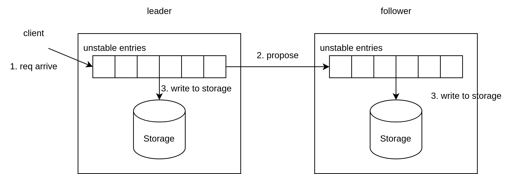
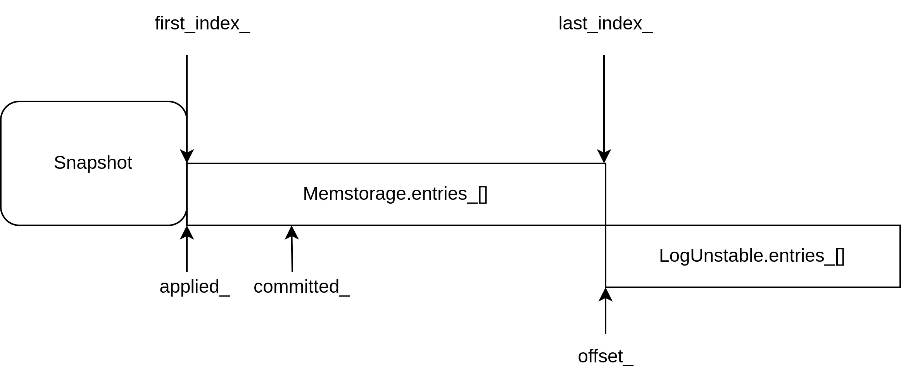

# RaftLog

`RaftLog` 用于管理 `raft` 节点的所有 `Entry`, 以及 `Entry` 组的状态(`committed_`, `applied_`), `RaftLog` 中又将 `Entry` 组分为 `unstable` 和 `stable` 两大块.

## MemoryStorage

`MemoryStorage` 由 `hardstate_`, `snapshot_` 以及 `entries_` 数组组成.

`MemoryStorage` 在初始化时, `snapshot_` 为空, `entries_` 数组中第一个 `entry` 为 `dummy entry`, 其 `index = 0`, `term = 0`.

`Snapshot` 结构由两部分组成:

+ `data`: 快照数据.
+ `metadata`: 包括集群状态, `data` 中的最后一个 `entry` 的 `index` 和 `term`.

初始时, `snapshot_` 为空, `entries_` 中第一个 `entry` 也为 `dummy entry`, 所以 `metadata` 中 `index` 和 `term` 也就和 `dummy entry` 的 `index` 和 `term` 相同.

`snapshot_` 可以通过外部传入参数进行构建(e.g. 节点重启时可以通过快照文件恢复). `ApplySnapshot()` 直接传入一个 `Snapshot`, 将 `snapshot_` 进行更新, 同时, `entries_` 中数据也会被清空, 并且构建一个 `dummy entry`: `entries_[0]`, 其 `index` 和 `term` 就是新传入的 `Snapshot` 的 `index` 和 `term`.

在系统不断运行, `entries_` 数组会扩大, 所以定期会创建快照并释放内存, 这里涉及两个步骤:

+ `CreateSnapshot()` 会帮助构建新的 `snapshot_`, 该快照截止到 `i`.
+ `Compact()` 将 `i` 之前的 `entry` 截断.

可以看到, `snapshot_` 中 `index` 和 `term` 和 `entries_[0]` 是时刻对应的.

剩余方法都是对特定 `entry` 的添加和查找, 添加通过 `Append()`, 如果待添加的 `entries` 和本地的 `entries_` 有重叠, 有以下两种情况:

+ `entries_[0] <= entries[0]`, 需要将待添加的 `entries` 截断.
+ `entries_[last] > entries[0]`, 需要将本地 `entries_` 截断.

## LogUnstable

与 `MemoryStorage` 对应的, `LogUnstable` 中存储的所有临时 `entry`(对于 `leader` 来说, 这些 `entry` 来自客户端, 对于 `follower` 来说, 这些 `entry` 来自 `leader`). 上层模块会对这些 `entry` 处理(广播或者写入 `Storage`), 处理完后, 会调用 `Advance()` 将这些 `entry` 删除.

`LogUnstable` 中主要保存 `snapshot_` 和 `entries_` 数组, 与 `MemoryStorage` 中不同的是, `entries_` 可能为空, 并且第一个 `entry` 也不是 `dummy entry`.

其中 `StableTo()` 和 `StableSnapTo()` 是记录被写入 `Stroage` 后, 擦除 `LogUnstable` 本地对应的 `entries_` 和 `snapshot_`. `Restore()` 则表明接收到一个 `Snapshot`, 除了需要重新设置本地的 `snapshot_`, `entries_` 数组也需要清空.

`TruncateAndAppend()` 向 `LogUnstable` 本地添加 `entries`, 分为三种情况:

+ 新添加进来的 `entries` 刚好与本地 `entries_` 连续, 就直接添加在后面.
+ `entries[0] < entries_[0]`, 就用新 `entries` 替换本地 `entries_`.
+ 两者有重叠, 就移除本地 `entries_` 重叠部分, 再将 `entries` 添加进来.

## RaftLog

`RaftLog` 由 `Storage` 和 `LogUnstable` 组成, 除此之外还保存有节点当前信息: `committed_` 和 `applied_`.

`raft` 节点向本地写入 `LogEntry` 会调用 `MaybeAppend()` 实现

+ `MaybeAppend()` 首先会检测本地 `prev_log_index` 处的 `index` 是否匹配, 不匹配直接返回.
+ 如果匹配, 会遍历本地 `entries_` 数组, 查看是否有和 `entries` 冲突的 `Entry`, 如果有冲突的 `Entry` 或者本地不存在 `Entry`, 则返回在该 `Entry` 处的 `index`, 否则就是不冲突, 返回 `0`.
+ 如果有冲突, 由于返回了一个 `index` 表明冲突位置, 对 `entries` 进行截断, 然后调用 `Append()` 写入本地, `Append()` 转而调用 `LogUnstable` 的 `TruncateAndAppend()` 写入本地.
+ 成功写入后, 将节点本地的 `committed_` 更新为 `std::min(committed, last_new_i)`, `last_new_i` 为写入的最后一条 `Entry` 的 `index`.

`RaftLog` 还为上层模块留了两个接口: `UnstableEntries()` 和 `NextEnts()`, 分别返回 `LogUnstable` 中的 `Entry` 数组和 `RaftLog` 中 `[applied_ + 1, committed_]` 区间的 `Entry`.